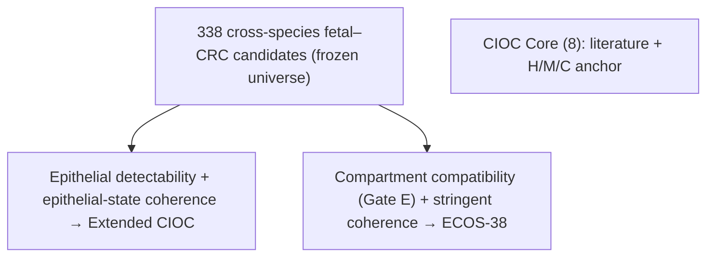

# Extended CIOC — plan (rules v1.0 FROZEN 2026-10-05, before computation)

## Architecture

| Level | Name | Definition | Status |
|---|---|---|---|
| 1 | **CIOC** | Literature-31 candidates passing Gates H, M, C (method v4.0 + data-QC amendment) | frozen |
| 2 | **Genome-wide fetal–CRC candidates** | Same frozen gates applied to every gene tested in ≥ 1 gate contrast | computed; frozen as the discovery universe |
| 2a | Cross-species fetal–CRC candidates | H ∧ M ∧ C | discovery universe for Level 3 |
| 2b | Human conserved fetal–CRC candidates | H ∧ C (mouse ignored; no cross-species evidence) | reported only |
| 3 | **Extended CIOC** | Level 2a ∩ Gate E (epithelial compatibility) ∩ CIOC program coherence | rules to be frozen before computation |

- Level 2 is **not a signature** and is not used for scoring. The name
  "Extended CIOC" is reserved for Level 3.
- Level 2 is produced by `scripts/build_genomewide_candidates.py`. Its
  membership is restricted (Gate C uses Joanito).
- **Internal validation.** Level 1 and Level 2 start from different
  nomination universes (31 literature genes vs every tested gene). The
  genome-wide search recovers all eight CIOC genes, and no other
  Literature-31 candidate passes H, M and C.

## Why Level 3 needs more than DE gates

Level 2a contains genes with strong, concordant H/M/C support from collagen,
smooth-muscle, endothelial and lymphoid programs. Examples are COL1A1, SPARC,
COL6A1, CALD1, MYL9, NOTCH3, PDGFB and LCK. DE gates cannot tell whether
the signal comes from:
- non-epithelial cells retained in "epithelial" pseudobulks or annotations;
- or mesenchymal-like transcription in developing or tumour epithelium.

Level 2a also mixes proliferation, translation, YAP, wound, EMT,
metabolism, stress and inflammatory programs. Two further requirements
address this:
- epithelial compatibility (Gate E);
- co-variation with the CIOC state.

Genes are not removed by hand. H, M and C are not modified.

## Gate E — epithelial compatibility (design stage)

**Intent:** exclude genes whose apparent signal is predominantly
attributable to non-epithelial compartments. It does **not** require
epithelial specificity, because programs shared with other compartments
are legitimate.

**Candidate metrics, per gene, from an atlas with all compartments:**
- detection in epithelial (tumour-derived or fetal) cells;
- epithelial share of expression across epithelial, fibroblast/stromal,
  endothelial, myeloid and lymphoid compartments.

Each metric is computed on donor-level compartment means.

**Order of work** (thresholds are not chosen in advance):
1. Plot the epithelial-vs-non-epithelial distribution for the Level 2a
   genes.
   - Canonical lineage markers are shown as calibrators: epithelial EPCAM,
     KRT8, CDH1; fibroblast COL1A2, DCN; endothelial PECAM1, VWF; immune
     PTPRC.
   - Candidate genes are not labelled on the plot.
2. Set the rule from technical detectability and the calibrators.
3. Freeze the rule.
4. Apply the rule.

**Reference requirement (open decision).** The reference must contain
epithelial and non-epithelial cells. It must also represent the states in
which these genes are expressed: tumour and/or fetal epithelium. It
should be independent of the gate datasets.
- **Locally available:** Tabula Sapiens Large Intestine is independent and
  has all compartments. It is **adult normal**, however. Oncofetal genes are
  by definition low in adult epithelium, so in this atlas genuine
  oncofetal-epithelial genes would look non-epithelial. The atlas can
  therefore serve only as a secondary check, not as the reference.
- **Not local:**
  - An independent CRC atlas with all compartments and non-overlapping
    patients. Joanito includes the SMC and KUL3 cohorts, so Lee 2020 is not
    independent. Options are Khaliq 2022 (GSE200997), Che 2021 (GSE178318)
    and Becker 2022 (HTAN, GSE201348). The accessions still need to be verified before download.
  - A fetal atlas with all compartments.

## CIOC program coherence (design stage)

**Question:** when the eight-gene CIOC state is high, is the candidate also
systematically high?

- **Data:** independent tumour-derived epithelial cells, not Joanito or Pelka.
  Ideally the same independent CRC atlas used for Gate E.
- **Candidate statistic:** within-tumour (patient-blocked) correlation
  between the candidate and the CIOC score.
  - The CIOC score is computed leaving the candidate out, which matters
    only for the CIOC genes themselves.
  - The correlation is computed on tumour-derived epithelial cells or
    metacells, and summarised across patients.
- **Controls:**
  - Use metacells or pseudobulk to limit dropout.
  - Regress or stratify by cell-cycle score so that proliferation does not
    drive coherence.
  - Build a null from random gene sets matched on expression level.
- **Rule:** to be frozen before computation. The final set size is not
  predetermined.

## Reference data (decided)

- **Primary:** Khaliq 2022 (GSE200997). 16 CRC + 7 adjacent normal, 10x,
  every compartment.
- **Replication:** Che 2021 (GSE178318). 6 patients, primary CRC + liver
  metastasis; PBMC excluded.
- **Independence:** neither dataset is used by any gate, and neither
  overlaps Joanito (SMC, KUL3, SG cohorts) or Pelka.
- **Secondary check only:** Tabula Sapiens Large Intestine (adult normal).
  It is reported as an annotation, never as a selection criterion.
- **Processing:**
  - `scripts/ext_01_prepare_atlases.py` builds raw-count AnnData objects.
  - `scripts/ext_02_annotate_compartments.py` annotates compartments.
    Neither deposit has cell types, so each Leiden cluster is assigned by
    canonical marker modules, scored as mean marker detection. No module
    contains a Level 2 candidate gene.
  - Khaliq: 1,236 ambiguous cells are excluded.
  - Epithelial cells from tumour tissue are called **tumour-derived
    epithelial cells** (the tumour epithelial compartment). Malignancy is
    not inferred (no CNV or mutation calling), and they are never called
    malignant. Gate E asks about compartment attribution, which does not
    require per-cell malignancy.

## Gate E — blinded descriptive profile (done)

Produced by `scripts/ext_03_gate_e_profile.py`.
- **Units:** patient × compartment pseudobulks from tumour-tissue cells.
  - Compartments: epithelial, stromal (fibroblast + SMC/pericyte),
    endothelial, myeloid, T/NK, B/plasma, mast.
  - A unit needs ≥ 20 cells, and a compartment needs ≥ 3 patients. Khaliq
    mast cells (2 patients) are dropped.
- **Ratio:** log2((epithelial CPM + 1) / (top non-epithelial compartment
  CPM + 1)), using patient medians.
- **Detectability:** the fraction of tumour epithelial cells with ≥ 1 UMI,
  as the patient median.
- **Blinding:** candidates are plotted unlabelled, and only quantiles and
  threshold counts were inspected.

**Calibrators (log2 ratio, Khaliq / Che):**

| Class | Genes | log2 ratio | Epithelial detection |
|---|---|---|---|
| Epithelial | EPCAM, KRT8, CDH1, KRT20, CEACAM5, CDX2 | +4.9 to +6.4 | 0.22–0.95 |
| Ubiquitous | GAPDH, ACTB, B2M | +0.3 to −2.5 | 0.73–0.99 |
| Non-epithelial, ambient-prone | LYZ, CD68 | −4.2 to −5.3 | 0.07–0.35 |
| Non-epithelial | PTPRC, CD3E, VIM, PECAM1, ACTA2, VWF, COL1A2, DCN | −5.1 to −11.8 | 0.00–0.30 |

Ubiquitous genes sit at −2.5 to +0.3. A max over six non-epithelial
compartments biases the ratio downward, and immune cells have different
library composition, so a truly shared gene is not expected at 0.

**Level 2 candidates (no gene identities inspected):**
- **Median log2 ratio:** −1.9 (Khaliq), −1.4 (Che). The background of
  expressed genes is centred near −0.5.
- **The candidates are shifted towards non-epithelial attribution.** For
  the candidates below 0, the top non-epithelial compartment is most often
  stromal, then endothelial.
- **Epithelial detectability is low in Khaliq.** Its epithelial cells have
  a median of 789 detected genes, against about 1,000 in other compartments.
  Che is more sensitive.

## Frozen rules v1.0 (approved 2026-10-05; committed before computation)

Rule history:
- **v0.1** was proposed after the blinded profile.
- **Review changed one rule:** E1 gained a severe-contradiction arm.
- **Review defined the coherence pass:** an empirical one-sided P.
- No gene identities were inspected before this freeze.

**Signature construction ends with this application.** Whatever set size
results, thresholds are not revisited and no gene is rescued.

### Gate E — epithelial compatibility

Ratio = log2((tumour-derived epithelial CPM + 1) / (top non-epithelial
compartment CPM + 1)), using patient medians. Atlases: Khaliq 2022 and Che
2021.

**E1 fails if either:**
- (a) the ratio is < −3 in both atlases; or
- (b) the ratio is < −5 in either atlas.

If the gene is measured in only one atlas, it fails if that atlas is < −3.

- **Methods wording for −3:** "A prespecified conservative threshold of
  −3 was chosen from blinded lineage calibrators to identify genes showing
  > 8-fold enrichment in a non-epithelial compartment relative to the tumour
  epithelial compartment."
- **−5 (> 32-fold)** lies in strict lineage-marker territory (calibrators
  −5.1 to −11.8). It is a severe contradiction on its own.

**E2 (detectability).** Detected (≥ 1 UMI) in ≥ 5% of tumour-derived
epithelial cells (patient median) in at least one atlas. Requiring it in
both would turn sequencing depth (Khaliq median 789 genes per epithelial
cell) into a biological veto.

**Gate E pass = E2 AND NOT E1-fail.**

Tabula Sapiens adult-normal attribution is annotation only.

### CIOC program coherence (on Gate E passes)

**Strata.** One stratum per sample (patient × tissue). These are Khaliq
tumour samples and Che primary-CRC and liver-metastasis samples, each with
≥ 200 tumour-derived epithelial cells. Coherence is computed within
strata, so tissue and patient differences cannot create it.

**Metacells.** Within each stratum:
- k-means (seed 0) on 20 PCs of the stratum's log-normalised epithelial
  cells, using atlas-level epithelial HVGs (2,000), with k = ⌊n/20⌋;
- counts are summed per metacell and converted to log2(CPM + 1);
- a stratum needs ≥ 10 metacells.

**Cell cycle.** S and G2M scores come from the Tirosh 2016 genes
(per-cell `score_genes_cell_cycle`, then the metacell mean). Within each
stratum, the candidate and the CIOC score are each residualised on
[1, S, G2M].

**CIOC score.** The mean within-stratum z-score of the eight CIOC genes.
- When the candidate is a CIOC gene, it is left out of the score (seven
  genes).
- A gene that is constant in a stratum is dropped from that stratum's
  score.

**Statistic.**
- Within each stratum: Spearman ρ between the residualised candidate and
  the residualised score.
- Per atlas: T = the mean Fisher z over strata where the candidate is
  non-constant.
- A candidate is evaluable in an atlas if it has ≥ 3 such strata.

**Null.**
- 1,000 random gene sets, the same sets for all candidates within an atlas.
- Each set is matched gene-for-gene to the score's genes by atlas-level
  mean-expression bin: 20 quantile bins over metacell-expressed genes,
  excluding the CIOC genes.
- Leave-one-out scores get matched seven-gene sets.
- The candidate is not excluded from the random pool, which is
  conservative.
- Empirical one-sided P = (1 + #{T_null ≥ T_obs}) / 1,001.

**Coherence pass:**
- evaluable in both atlases;
- T_obs > 0 in both atlases;
- empirical P < 0.05 in at least one atlas.

BH-FDR across candidates is reported as annotation only and is not a hard
gate.

### Extended CIOC

**Extended CIOC = cross-species fetal–CRC candidates (338) ∩ Gate E ∩
coherence.**

### Role of the two atlases

- **Khaliq and Che** are **independent replication within the refinement
  stage**. They contribute to construction, so they are **not** external
  validation datasets.
- **External validation** will use other CRC atlases and spatial datasets.
  It will never feed back into membership.

### Final layers

| Layer | Role |
|---|---|
| CIOC (8) | High-specificity biological anchor |
| 338 cross-species fetal–CRC candidates | Genome-wide discovery universe; not for scoring |
| Extended CIOC | Epithelial-compatible, Core-coherent program for robust scoring |

## Application (2026-10-05; frozen rules v1.0, applied once)

Produced by `scripts/ext_04_extended_cioc.py`. Membership and per-gene
values are in the restricted workbook `Extended_CIOC.xlsx`.

**Funnel:**

| Step | Genes |
|---|---|
| Cross-species fetal–CRC candidates | 338 |
| Gate E: E1 fail (66 via both < −3; 3 via the < −5 arm only) | 69 |
| Gate E: E2 fail | 116 |
| Gate E pass | 189 |
| Coherence evaluable in both atlases | 189 |
| **Coherence pass = Extended CIOC** | **38** |

- **Coherence strata:** 8 in Khaliq and 8 in Che.
- **Two CIOC core genes are in the Extended CIOC.** Gate E failures
  (non-epithelial attribution) account for four core genes, and coherence
  failures account for two.
- **Gate E applies only to Level 2.** The eight-gene CIOC (Level 1) is
  unchanged.
- **Interpretation:**
  - Several CIOC genes are expressed far more strongly by stromal, myeloid,
    endothelial or mast compartments in tumour tissue than by tumour-derived
    epithelium. This holds even though their epithelial expression rises
    (Joanito and Pelka).
  - Readouts of the eight-gene CIOC in bulk or spatial data without
    cell-type resolution will therefore be dominated by the
    microenvironment.
  - The Extended CIOC is the epithelial-compatible scoring set.
- **Coherence:** every Gate E candidate correlates positively with the CIOC
  score within strata (a shared axis). The expression-matched null absorbs
  this axis, and membership requires beating that null.
- **Construction ends here.** Thresholds are not revised and no gene is
  rescued. Khaliq and Che are refinement-stage replication, not external
  validation.

## Revision v2.0 — state specificity vs lineage specificity (frozen 2026-10-05, before computation)

The v1.0 output answered a different question from the one the Extended
CIOC should answer, so the two are now separate objects.
- **State specificity:** does the gene track the oncofetal state within
  epithelial cells?
- **Lineage specificity:** is the gene safe to score without cell-type
  resolution?

A gene can be a valid epithelial oncofetal-state marker and still be
expressed more strongly by stromal or immune cells: several genes show
epithelial induction but higher myeloid, stromal or mast expression (gene
identities in the restricted workbook). **Non-epithelial expression
limits mixed-cell scoring. It is not evidence against epithelial
oncofetal-state membership.**

H, M and C, the eight-gene CIOC, the 338-gene universe and the v1.0 output
are not changed.

ECOS-38 and the Extended CIOC are two branches from the 338 candidates.
Neither is described as a subset of the other.

### ECOS-38 (the v1.0 output, renamed; membership not recomputed)

- **Name:** Epithelial-Compatible Oncofetal Signature (ECOS-38), with
  identifier `ECOS_38`.
- **Members:** exactly the 38 genes from the v1.0 application.
- **Use:** bulk RNA-seq, unresolved or mixed-cell spatial data, and any
  dataset where epithelial cells cannot first be isolated.
- **Wording:**
  - It is *epithelial-compatible*: there is no strong, reproducible
    non-epithelial attribution, and there is epithelial detectability.
  - It is never "epithelial-specific" or "epithelial-exclusive".
- **Annotations:** the Gate E results are retained as
  compartment-attribution annotations.

### Extended CIOC v2.0 — epithelial-only (rule frozen here)

**Question:** among the 338, which genes reproducibly track the CIOC state
within the tumour-derived epithelial compartment?

**Data:** tumour-derived epithelial cells only (Khaliq 2022, Che 2021).
- The existing compartment annotation and strata are used.
- Malignancy is not inferred.
- Stromal, immune and endothelial expression is ignored entirely. Gate E
  E1 is **not** a criterion.

**D — detectability (minimal).** The gene must be detected in ≥ 5% of
tumour-derived epithelial cells (patient median) in at least one atlas.
This is an evaluability criterion, not a lineage test.

**Coherence.** The v1.0 framework is used unchanged:
- ~20-cell metacells within sample strata (≥ 200 cells, ≥ 10 metacells);
- the cell cycle (S and G2M) is regressed out;
- the eight-gene CIOC score, leaving the gene out when the candidate is a
  CIOC gene;
- within-stratum Spearman, then the mean Fisher z over strata, T (≥ 3
  strata to be evaluable);
- the same seed and null construction.

**Membership: Extended CIOC = D pass AND evaluable in both atlases AND
T > 0 in both atlases.**

**Annotations, never selecting:**
- empirical P per atlas against the 1,000 expression-matched random sets;
- P < 0.05 in either atlas, and P < 0.05 in both;
- the **high-confidence CIOC-coherent** flag (T > 0 in both and P < 0.05
  in ≥ 1);
- the Gate E compartment-attribution values and the E1 call;
- Tabula Sapiens;
- ECOS-38 membership.

**Foreseeable property, recorded before computation.** In v1.0, all 189
genes tested had T > 0 in both atlases: tumour-derived epithelial
metacells share a strong common axis. Membership under v2.0 is therefore
expected to be driven mainly by detectability and evaluability. In that
case the high-confidence flag carries the discriminating coherence
information. This is noted for interpretation and does not change the
rule.

**Construction ends with this application.** No rule is tuned and no gene
is rescued or removed.

### Application of v2.0 (2026-10-05; applied once)

Produced by `scripts/ext_05_extended_cioc.py`. Membership is in the
restricted workbook `Extended_CIOC.xlsx`.
- **Reproduction:** the coherence functions are imported unchanged from
  `ext_04_ecos38.py`. All 189 genes tested in v1.0 reproduce T and the
  empirical P exactly.

**Funnel:**

| Step | Genes |
|---|---|
| Cross-species fetal–CRC candidates | 338 |
| D fail (epithelial detectability < 5% in both atlases) | 116 |
| D pass | 222 |
| Not evaluable in both atlases / T ≤ 0 in ≥ 1 atlas | 0 / 0 |
| **Extended CIOC** | **222** |
| High-confidence CIOC-coherent (annotation) | 56 |
| P < 0.05 in both atlases (annotation) | 10 |
| E1 non-epithelial attribution FAIL (annotation) | 33 |

- All 8 CIOC genes and all 38 ECOS-38 genes are in the Extended CIOC.
- **The positivity criterion excluded no gene, as recorded before
  computation.** The Extended CIOC therefore equals the 338 restricted to
  epithelial-detectable genes, and the high-confidence flag carries the
  discriminating coherence information.
- **Relationship between the two branches.** ECOS-38 equals the
  high-confidence genes with E1 pass. Of the 56 high-confidence genes, 18
  fail E1. These include CIOC genes that are coherent within epithelium
  despite strong non-epithelial expression, which supports the
  state-vs-lineage distinction.
- **Caveat.** Membership based only on epithelial cells cannot separate
  true epithelial expression from immune or stromal doublets or ambient RNA
  in epithelial clusters. Examples are LCK and FYN (T/NK-dominant, and
  high-confidence) and MYL9 and TPM2 (stromal-dominant). The E1 annotation
  marks such genes. They are reported, not removed.
- **Signature construction is complete.** The final objects are:
  - CIOC Core (8);
  - the 338 cross-species fetal–CRC candidates (universe);
  - Extended CIOC v2.0;
  - ECOS-38.
