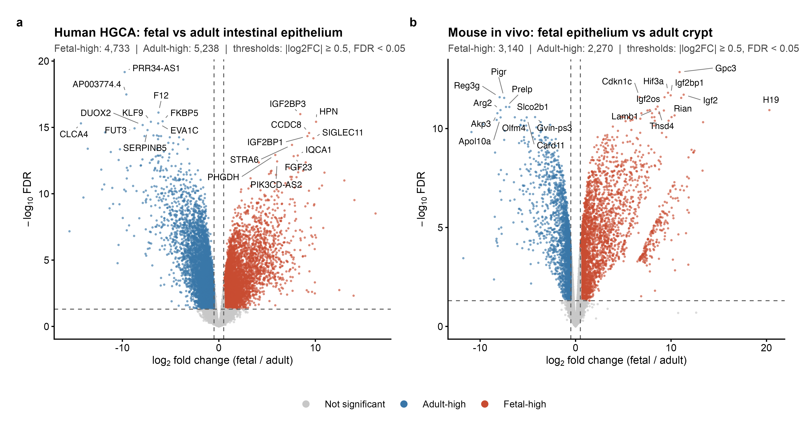
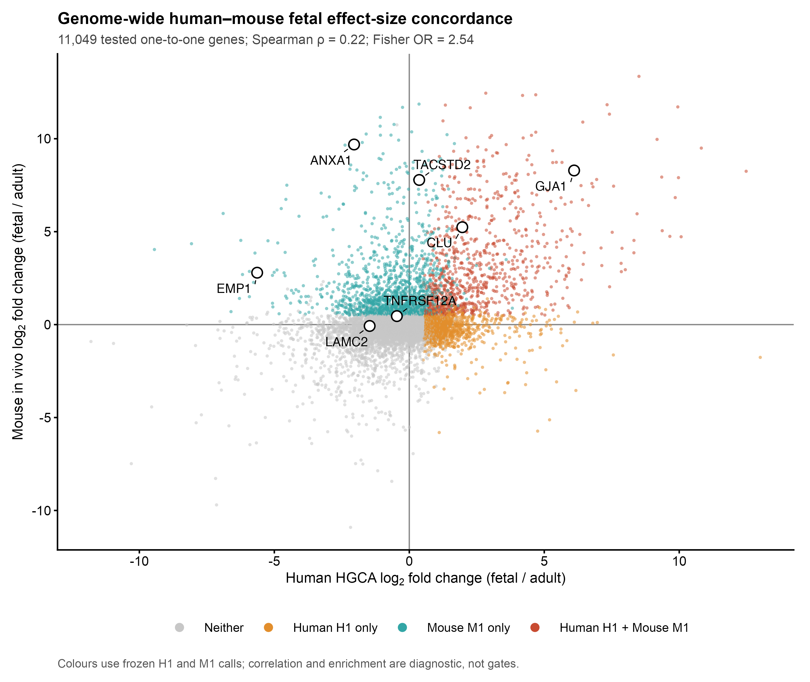

## Objective

Identify intestinal epithelial genes with reproducible fetal-high expression in
HGCA human discovery, Gao 2018 human replication, and an in-vivo mouse
fetal-versus-adult comparison.

## Frozen evidence chain

```text
HGCA H1 ∩ Gao H2 ∩ mouse M1 = Conserved Fetal-High Candidates
```

The complete statistical definitions are in [ANALYSIS_PLAN.md](ANALYSIS_PLAN.md),
and exact execution details are in [EXECUTION_REPORT.md](EXECUTION_REPORT.md).

## Inputs and biological replicates

| Dataset | Role | Biological replicates |
|---|---|---:|
| HGCA | human discovery | 16 fetal, 7 adult donors |
| Gao 2018 | human replication | 12 fetal embryos, 2 adult donors |
| GSE230581 | mouse in-vivo evidence | 3 fetal, 3 adult samples |

Raw and processed data are managed under `/Volumes/Stelligen_SSD/Stelligen/DATA`.
They are not stored in GitHub.

## Differential expression results

| Gate | Passing genes |
|---|---:|
| HGCA primary | 4,733 |
| Complete H1 with proliferative control | 4,645 |
| Gao H2 | 5,271 |
| Mouse M1 | 3,140 |
| Strict H1 ∩ H2 ∩ M1 | **706** |

Positive fold change denotes fetal-high expression. HGCA and mouse differential
expression used edgeR quasi-likelihood models on biological-replicate count
profiles. Gao was retained as effect-only validation.

## Human and mouse volcano plots

{fig-alt="Paired volcano plots for human and mouse fetal versus adult intestinal epithelium" width=100%}

The full DEG tables are:

- `results/tables/human_HGCA_fetal_vs_adult_DEG.csv`
- `results/tables/mouse_in_vivo_fetal_vs_adult_DEG.csv`

## Final output

`results/tables/Conserved_Fetal_High.csv` contains 706 genes. Each row retains
human discovery, adult-proliferative control, Gao adult-donor values, mouse
evidence, and Ensembl release 116 one-to-one orthology fields.

## Reviewer sanity checks

The mouse count table contains 24,587 non-empty gene symbols and **zero duplicate
symbol rows**, so the symbol-based join does not collapse duplicated genes.

There are 425 mouse genes with `Mouse_log2FC > 5`. The audit table retains raw
CPM for each of the three fetal and three adult samples. Their minimum fetal mean
raw CPM is 1.522 and none has fetal mean raw CPM below 1. The extreme-right
volcano points are therefore consistent with fetal expression plus very low or
absent adult expression, rather than a near-zero/near-zero artifact.

### Genome-wide cross-species diagnostic

{fig-alt="Genome-wide scatter comparing human HGCA and mouse fetal versus adult effect sizes" width=85%}

Across the unbiased tested universe, Spearman rho is 0.222. The frozen H1 and
M1 sets overlap at 998 genes, with Fisher odds ratio 2.54 and one-sided
P = 2.4e-79. Thus effect sizes show modest global concordance while fetal-high
calls are substantially enriched across species. Neither statistic is a gate.
The prior rho = 0.485 among the final 706 is conditioned on positive selection
in both species and must not be used as a genome-wide conservation estimate.

### Literature-candidate gate audit

`results/tables/Literature_31_gate_failure_audit.csv` retains all requested gate
values and calls for the 31 curated candidates. TACSTD2, ANXA1, and TNFRSF12A
all first fail the HGCA primary gate, rather than Gao. TACSTD2 has HGCA log2FC
0.368 (FDR 0.572) but passes Gao H2 and mouse M1; ANXA1 is adult-high in HGCA
(log2FC -2.045) while passing mouse M1; TNFRSF12A is not fetal-high in HGCA
(log2FC -0.460) and passes neither Gao H2 nor mouse M1. Gates were not changed.

## Reproduction and QA

- Run the complete workflow with `bash step2_fetal/scripts/run_step2.sh`.
- See [RUNBOOK.md](RUNBOOK.md) for dependencies and restart points.
- See [QA.md](QA.md) for integrity, assertion, and figure checks.
- See the repository-level `WORKLOG.md` for chronological decisions.

No joint integration, UMAP, trajectory, fetal-age analysis, GSEA, or organoid
substitution was introduced in Step 2.
